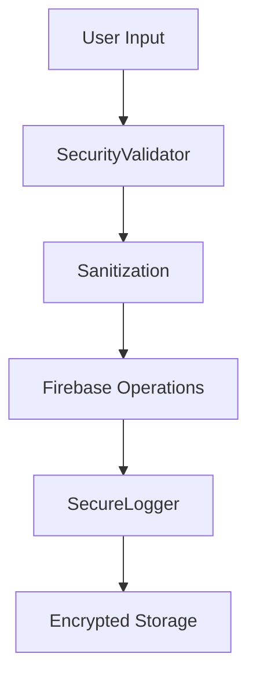

# 📱 UniLocator Android

<div align="center">

**Android Application for the UniLocator Project**

> 🌐 **Part of UniLocator Ecosystem** - Web App: [UniLocator-Web](https://github.com/Prantiux/UniLocator-Web)

[](https://developer.android.com/)
[](https://kotlinlang.org/)
[](https://firebase.google.com/)
[](https://material.io/)

</div>

---

## 🌟 About UniLocator

**UniLocator** is a comprehensive device tracking and management ecosystem that helps users locate, track, and manage their devices across multiple platforms. The project consists of:

- 🌐 **Web Application** ([UniLocator-Web](https://github.com/Prantiux/UniLocator-Web)) - Full-featured web interface for device management
- 📱 **Android Application** (This Repository) - Native mobile app with advanced device pairing and tracking capabilities

### Project Vision

UniLocator aims to provide a seamless, secure, and intuitive solution for device management across different platforms. Whether you need to track your phone, tablet, laptop, or any smart device, UniLocator offers real-time synchronization, smart pairing, and enterprise-grade security.

---

## 📱 Android App Overview

This Android application is a sophisticated mobile client for the UniLocator ecosystem, designed for seamless device tracking and management. Built with modern Android architecture principles, it provides enterprise-grade security, real-time synchronization, and an intuitive user interface.

### ✨ Key Features

- 🔐 **Secure Authentication** - Firebase-powered authentication with email/password
- 📱 **Multi-Device Management** - Track and organize multiple devices effortlessly
- 🔗 **Smart Device Pairing** - QR code scanning and 8-character pairing codes
- 🎨 **Modern UI/UX** - Material Design 3 with dark theme and green accents
- 🔄 **Real-time Sync** - Instant cross-device synchronization
- 🛡️ **Enterprise Security** - Comprehensive security implementation with input validation
- 📊 **Device Analytics** - Last seen timestamps and device information tracking

---

## 🚀 Quick Start

### Prerequisites

- **Android Studio** Hedgehog (2023.1.1) or later
- **Android SDK** API level 24 (Android 7.0) or higher
- **Kotlin** 1.9.0 or later
- **Firebase Project** (setup required - see configuration below)

### 🔧 Installation

1. **Clone the Repository**
   ```bash
   git clone https://github.com/Prantiux/UniLocator-Android.git
   cd UniLocator-Android
   ```

2. **Firebase Configuration** 🔥
   
   > ⚠️ **IMPORTANT**: This repository does not include Firebase credentials for security reasons.
   
   **Setup your Firebase project by following our comprehensive guide:**
   
   📖 **[Complete Firebase Setup Guide](FIREBASE_SETUP.md)**
   
   Quick overview:
   - Create a new Firebase project
   - Enable Authentication (Email/Password)
   - Set up Firestore database
   - Download and add your `google-services.json`

3. **Build & Run**
   ```bash
   # Using Gradle Wrapper
   ./gradlew assembleDebug
   
   # Or open in Android Studio and build
   ```

---

## 🏗️ Architecture

### Tech Stack

- **Language**: Kotlin 100%
- **UI Framework**: Jetpack Compose + Material Design 3
- **Architecture**: MVVM with Repository Pattern
- **Backend**: Firebase (Authentication, Firestore, Cloud Functions)
- **Security**: Enterprise-grade with ProGuard obfuscation
- **Build System**: Gradle with version catalogs

### Project Structure

```
app/src/main/
├── java/com/pramanshav/unilocator/
│   ├── activities/
│   │   ├── MainActivity.kt          # Splash & navigation
│   │   ├── AuthActivity.kt          # Authentication flows
│   │   └── TestActivity.kt          # Main dashboard
│   ├── models/
│   │   ├── Device.kt                # Device data model
│   │   └── User.kt                  # User data model
│   ├── utils/
│   │   ├── DeviceRegistrationManager.kt  # Device operations
│   │   ├── SecurityValidator.kt          # Input validation
│   │   ├── SecureLogger.kt               # Secure logging
│   │   └── DeviceIdGenerator.kt          # Device ID generation
│   └── ui/
│       ├── theme/                   # Material Design 3 theme
│       └── components/              # Reusable UI components
├── res/
│   ├── layout/                      # XML layouts
│   ├── values/                      # Strings, colors, dimensions
│   └── xml/
│       └── network_security_config.xml  # Network security
└── AndroidManifest.xml
```

---

## 🔒 Security Features

UniLocator implements enterprise-grade security measures:

### 🛡️ Comprehensive Protection

- **🔐 Data Encryption** - All sensitive data encrypted at rest and in transit
- **🌐 Network Security** - HTTPS-only communication with certificate pinning
- **🧹 Input Sanitization** - Comprehensive validation and sanitization of all inputs
- **📝 Secure Logging** - Automatic removal of sensitive data from logs in production
- **🔧 Code Obfuscation** - ProGuard rules protect against reverse engineering
- **🚫 Debug Protection** - Debug features disabled in release builds

### Security Architecture



---

## 🎨 Design System

### Color Palette

```kotlin
Primary Color:    #037d3a (Green)
Background:       #121212 (Dark)
Surface:          #1e1e1e (Dark Gray)
Text Primary:     #ffffff (White)
Text Secondary:   #b3b3b3 (Light Gray)
Error:           #cf6679 (Red)
```

### Typography

- **Headings**: Roboto Medium
- **Body**: Roboto Regular
- **Captions**: Roboto Light

---

## 📱 User Experience

### Authentication Flow

1. **Splash Screen** - Auto-login check with smooth animations
2. **Login/Register** - Clean, intuitive forms with real-time validation
3. **Dashboard** - Device overview with quick actions
4. **Device Management** - Add, rename, and track devices

### Device Pairing

```
Method 1: QR Code Scanning
┌─────────────────┐    ┌─────────────────┐
│   Scan QR Code  │ -> │  Instant Pair   │
└─────────────────┘    └─────────────────┘

Method 2: Pairing Code
┌─────────────────┐    ┌─────────────────┐
│  Enter 8-digit  │ -> │   Secure Pair   │
│      Code       │    │                 │
└─────────────────┘    └─────────────────┘
```

---

## 🛠️ Development

### Build Variants

- **Debug** - Full logging, debugging tools enabled
- **Release** - Optimized, obfuscated, production-ready

### Testing

```bash
# Run unit tests
./gradlew test

# Run instrumented tests
./gradlew connectedAndroidTest

# Generate test reports
./gradlew jacocoTestReport
```

### Code Quality

- **Static Analysis**: Android Lint, Detekt
- **Code Style**: Kotlin coding conventions
- **Architecture**: Clean Architecture principles

---

## 🔧 Configuration

### Firebase Setup

The application requires Firebase configuration. Follow the detailed setup guide:

📖 **[Firebase Setup Instructions](FIREBASE_SETUP.md)**

### Environment Variables

```properties
# local.properties (not committed)
MAPS_API_KEY=your_maps_api_key_here
DEBUG_KEYSTORE_PASSWORD=your_debug_password
```

---

## 📊 Performance

### Metrics

- **Cold Start Time**: < 2 seconds
- **App Size**: < 15MB (Release APK)
- **Memory Usage**: < 100MB average
- **Battery Impact**: Minimal background usage

### Optimizations

- ProGuard code shrinking and obfuscation
- Resource optimization
- Efficient Firebase queries
- Lazy loading of non-critical components

---

## 🤝 Contributing

We welcome contributions to the UniLocator Android app! Please see our contributing guidelines:

### Development Team

- **Prashant** ([@prshhnt](https://github.com/prshhnt)) - Lead Android Developer
- **Himanshu** ([@himaanshuuyadav](https://github.com/himaanshuuyadav)) - Backend & Firebase Integration

### How to Contribute

1. Fork the repository
2. Create a feature branch (`git checkout -b feature/amazing-feature`)
3. Commit your changes (`git commit -m 'Add amazing feature'`)
4. Push to the branch (`git push origin feature/amazing-feature`)
5. Open a Pull Request

### Development Setup

1. Follow the installation steps above
2. Set up pre-commit hooks
3. Run tests before submitting PRs

---

## 📄 License

This project is licensed under the MIT License - see the [LICENSE](LICENSE) file for details.

---

## 🆘 Support & Troubleshooting

### Common Issues

| Issue | Solution |
|-------|----------|
| Build errors | Ensure `google-services.json` is properly configured |
| Authentication fails | Check Firebase Auth settings and internet connection |
| Sync issues | Verify Firestore security rules and user permissions |

### Getting Help

- 📖 **Documentation**: Check our [Firebase Setup Guide](FIREBASE_SETUP.md)
- 🐛 **Bug Reports**: Open an issue on GitHub
- 💬 **Discussions**: Use GitHub Discussions for questions
- 📧 **Email**: contact@unilocator.app

### Useful Links

- [Firebase Documentation](https://firebase.google.com/docs)
- [Android Developer Guides](https://developer.android.com/guide)
- [Material Design Guidelines](https://material.io/design)
- [Kotlin Documentation](https://kotlinlang.org/docs/)

---

<div align="center">

**Made with ❤️ for seamless device management**

[⭐ Star this repo](https://github.com/Prantiux/UniLocator-Android) • [🍴 Fork it](https://github.com/Prantiux/UniLocator-Android/fork) • [📱 Download APK](https://github.com/Prantiux/UniLocator-Android/releases)

**🌐 Explore the Full UniLocator Ecosystem:**
[Web App](https://github.com/Prantiux/UniLocator-Web) • [Android App](https://github.com/Prantiux/UniLocator-Android)

</div>
